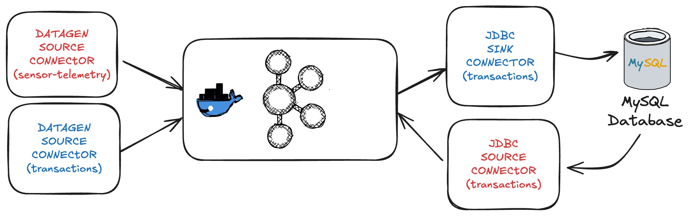

## Organización

La carpeta se organiza en los directorios

- **datagen**: contiene los schemas de los dos datasets de FarmIA (*.avsc)

- **connectors**: contiene los ficheros de configuración de los conectores a desarrollar (*.json)

## Setup

El siguiente script automatiza algunos de los pasos necesarios para preparar el entorno
para desarrollar la tarea.

1. Inicia el entorno.
2. Crea la tabla transactions.
3. Instala los plugins de los conectores.
4. Copia los drivers JDBC para MySQL.
5. Copia los schemas AVRO dentro del contenedor de connect.

```shell
./setup.sh
```

## Kafka Connect

Con el fin de simular un escenario real y crear interactividad en la tabla de transacciones se proporcionan un par de conectores para cargar la tabla transactions forma continua.



Los conectores proporcionados hacen uso del topic **_transactions** para cargar la tabla **sales_transactions** en la bd MySQL

- source-datagen-_transactions: Genera transacciones que cumplen el schema requerido

- sink-mysql-_transactions: Escribe las transacciones en la tabla de base de datos 

El alumno es responsable de crear los dos conectores en rojo:

- source-datagen-sensor-telemetry [DatagenSource](https://github.com/confluentinc/kafka-connect-datagen/blob/master/README.md#configuration) 

- source-mysql-transactions [JDBCSource](https://docs.confluent.io/kafka-connectors/jdbc/current/source-connector/overview.html)

**NOTA**

Explorar el **modo incremental** para el conector JDBCSource utilizando la columna timestamp

Para poder hacer el procesamiento posterior es **importante** que los registros generados por ambos conectores lleven el campo **key** informado.
En alguno de los conectores pueden requerir aplicar SMTs (Simple Message Transformations)

De igual modo, se proporciona un script para automatizar la ejecución de todos los conectores:

```shell
./start_connectors.sh
```

**NOTA**

Los conectores a desarrollar por el alumno están comentados en el script. Descomentar una vez completados

## Organización del proyecto

`connectors/:` Configuraciones de Kafka Connect

`src/main/avro/:` Schemas Avro para los datos

`src/main/java/:` Aplicaciones de Kafka Streams

`scripts:` Automatización para la preparación del entorno

## Configuración de Ficheros
### pom.xml
- Se ha añadido plugins de Avro y Schema Registry:
`avro-maven-plugin` sirve para compilar automáticamente las clases java a partir de los schemas avro creados. Y `kafka-schema-registry-maven-plugin` sirve para interactuar con el Schema Registry de Confluent
- Se añadió `kafka-streams-avro-serde` para serializar/deserializar datos Avro en las aplicaciones de Kafka Streams, en este caso es esencial para `SalesSummaryApp.java`

## Tarea 1

Se ha configurado un conector JDBC (`source-mysql-transactions.json`) que:
1. Extrae datos de la tabla `sales_transactions` en MySQL
2. Usa el campo **timestamp** para capturar solo cambios nuevos (modo incremental)
3. Aplica transformaciones para:
   - Estructurar los datos según el schema Avro
   - Usar el campo **category** como clave de mensaje
4. Asigna el schema Avro com.farmia.sales.SalesTransaction
5. Envía los datos al topic `sales-transactions`


## Tarea 2

Para la generación de datos sintéticos (datagen) se ha hecho lo siguiente:

1. Diseño del schema `sensor-telemetry.avsc` para los datos de sensores
2. Configuración del conector `source-datagen-sensor-telemetry.json` que:
   - Genera datos sintéticos basados en el schema
   - Usa **sensor_id** como clave del mensaje
   - Produce mensajes cada segundo (1000ms) al topic `sensor-telemetry`

## Tarea 3

`SensorAlerterApp` procesa en tiempo real con Kafka Streams y genera alertas cuando se detectan condiciones peligrosas.

### Flujo de Procesamiento:
1. Entrada:
   - Consume mensajes del topic `sensor-telemetry`.


2. Condición para la detección:
```
.filter((key, value) -> value.getTemperature() > 35 || value.getHumidity() < 20)
```

3. Generación de Alertas:

* Transforma los datos en objetos `SensorAlert` con:
  - alert_type: "HIGH_TEMPERATURE" o "LOW_HUMIDITY"
  - details: Mensaje descriptivo. Por ejemplo: "Temperature exceeded 35°C"
  - Conserva el **sensor_id** y **timestamp** originales de `sensor-telemetry`.

4. Salida:
- Publica las alertas en el topic sensor-alerts (formato Avro).

## Tarea 4
### Kafka Streams
Se ejecuta la aplicación `SalesSummaryApp.java`. Procesa en tiempo real el resumen de las transacciones de venta por categoría cada minuto.

### Flujo de Procesamiento:
1. Entrada:
   - Se consume los mensajes del topic `sales-transactions`


2. Agregación por categoría:
   - Se agrupa las transacciones por categoría
   - Se crea ventanas temporales de 1 minuto para calcular las métricas

```
.groupBy((key, transaction) -> transaction.getCategory().toString())
.windowedBy(TimeWindows.of(Duration.ofMinutes(1)))
```

3. En el cálculo de las métricas, el campo **total_quantity** es la suma total de unidades vendidas. Y el campo **total_revenue** es la suma de ingresos totales *(price * quantity)*
4. Salida:
   - Publicación de los resúmenes de venta en el topic `sales-summary`
   - La estructura del resumen será lo siguiente:
```json
{
  "category": "fertilizers",
  "total_quantity": 20,
  "total_revenue": 1000.0,
  "window_start": 1673548200000,
  "window_end": 1673548260000
}
```

**NOTA**
La estructuración de los ficheros *.avsc* se ha decidido del siguiente modo:
* Schemas completos para Datagen en `datagen/`
* Schemas limpios para las aplicaciones en `src/main/avro/`

## Shutdown

El siguiente script para el entorno

```shell
./shutdown.sh
```